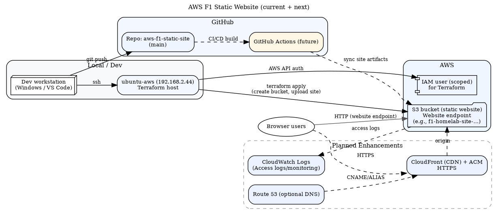

# AWS F1 Static Site 🏎️

Formula 1–themed static website deployed to AWS using **Terraform**, **Docker**, and optionally extended with **CloudFront**, **ACM (TLS)**, **GitHub Actions**, and **CloudWatch**.  
A homelab project that combines cloud engineering best practices with my passion for F1. 🏁

---

## 🚀 Deployment Workflow

1. **Ubuntu VM Setup**  
   Created a dedicated VM (`ubuntu-aws`) with static IP `192.168.2.44` (Hamilton tribute 🏎️)

2. **SSH Key Integration**  
   Connected from Windows via `ssh ubuntu-aws` using secure key-based login

3. **Terraform Init & Apply**  
   Provisioned AWS S3 bucket and uploaded a custom F1-themed website

4. **Version Control**  
   Clean repo pushed to [GitHub](https://github.com/dj-3dub/aws-f1-static-site), excluding Terraform state and cache files

---

## 🔒 Security

- IAM user with scoped-down permissions used for Terraform  
- `.terraform/` and `.tfstate` files excluded via `.gitignore`

---

## 🌐 Live Website

🌍 [f1-homelab-site-49c3df1f.s3-website-us-east-1.amazonaws.com](http://f1-homelab-site-49c3df1f.s3-website-us-east-1.amazonaws.com/)

---

## 🏗️ Architecture

> Current: S3 Static Website Hosting.  
> Planned: CloudFront + ACM, CI/CD via GitHub Actions, and CloudWatch logging.

<p align="center">
  
</p>

---

## 🎯 Next Goals

- [ ] Add **CloudFront** CDN  
- [ ] Set up **GitHub Actions** for CI/CD deployments  
- [ ] Monitor access logs via **CloudWatch**

---

## 🐳 Dockerized Local Deployment

Want to run this F1 site locally in seconds?  
You can spin it up with Docker—no AWS or extra config needed.

### Quick Start

```bash
git clone https://github.com/dj-3dub/aws-f1-static-site.git
cd aws-f1-static-site
docker build -t aws-f1-website .
docker run -d --name f1site -p 8080:80 aws-f1-website
